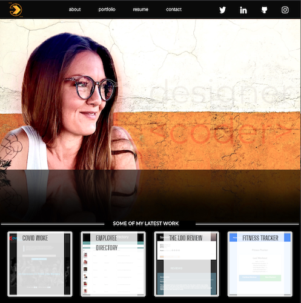
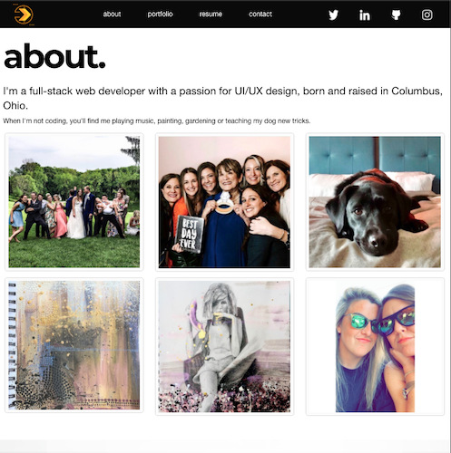
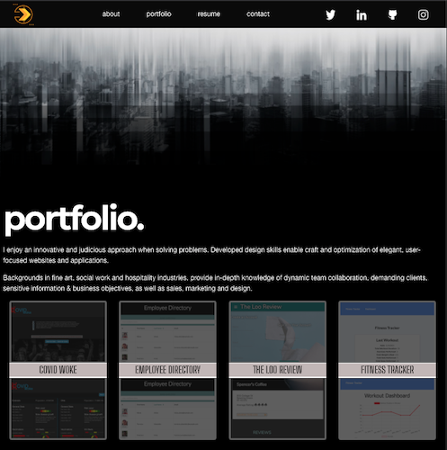

# Professional Portfolio with React

Full stack web developer with a passion for UX/UI design, eager to contribute developed knowledge in a front-end role. An innovative and judicious approach complement design skills enabling craft and optimization of elegant, user-focused websites and applications. Backgrounds in fine art, social work and hospitality industries, provide in-depth knowledge of dynamic team collaboration in demanding environments, difficult clients, sensitive information & business objectives, as well as sales, marketing, and design.

## Table of Contents

- [Description](#portfolio-03)
- [Contributing](#contributing)
- [Technologies](#tech)
- [Visuals](#visuals)
- [Contact Me](#questions)
- [License](#license)

## Contributing

k.wilkinson

### Tech

React framework
react-foundation

## Visuals

[ViewLive](https://nahco-code.github.io/portfolio-react/#/) -  - [ViewCode](https://github.com/NAHco-code/portfolio-react.git)

## Questions?

Please feel free to contact me with any questions via email or LinkedIn.

- Github: [NAHco-code](https://github.com/NAHco-code)
- LinkedIn: [kwilkinsonxx](https://www.linkedin.com/in/kwilkinsonxx/)
- Email: [kathrynxwilk@gmail.com](kathrynxwilk@gmail.com)

## License

This project is licensed under the MIT License.
For more information, please visit: [MIT Explained](https://choosealicense.com/licenses/mit/)

&copy; 2021 k.wilkinson
